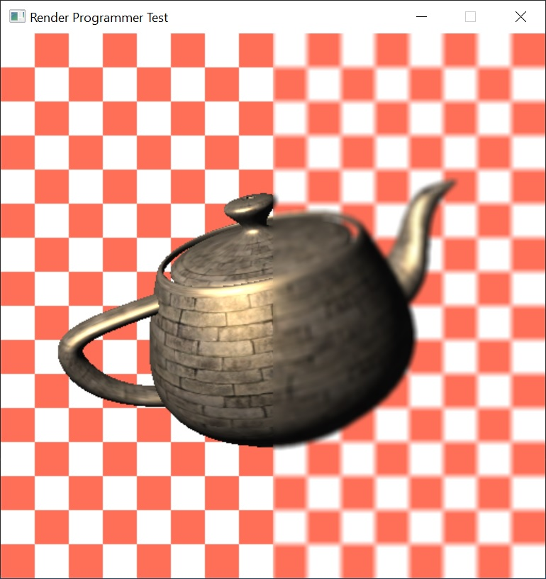

# rpt
Render Programmer Test

<p align="center">
    
</p>


To clone:
```
git clone --recursive https://github.com/vcoda/rpt.git
```

To build, download LunarG SDK:
```
https://www.lunarg.com/vulkan-sdk/
```

check Vulkan SDK path in environment variables:
```
echo %VK_SDK_PATH%
```
